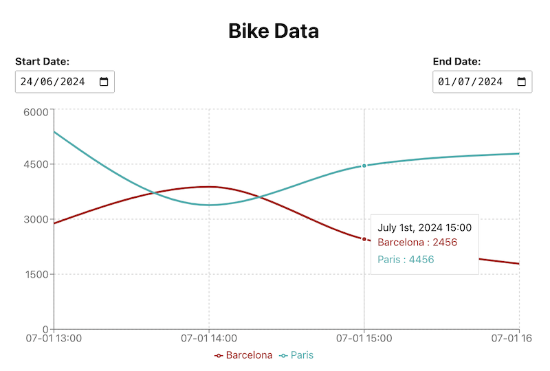

# fullinfo-test

## Task

On https://api.citybik.es/v2/ you can find an API which can be used to retrieve data of city bike networks worldwide and the availability of bikes per network.

Write a proof of concept application which:

1) Polls this api regularly for a set of pre-configured cities and stores every hour per city the average total amount of free bikes of all bike stations in that city. Note, do not poll too often, data is only refreshed once in a while. Develop a smart polling algorithm for this.

2) Provides a simple but elegant web user interface which can be used to query stored data (be creative here)

Ensure and proof the most essential part of your code is covered by unit tests. Use any technology you like or think is necessary.

Prepare a short presentation to explain your understanding of the problem, the assumptions you worked with, your approach, technical solution and a small demo.



## Scripts

### Start Server
```sh
npm run server
```
Starts the back-end server, provides the api for the front-end as well as, schedules api poll and database store tasks.
If not set, smartly detects the polling interval.
Starts in-memory MongoDB with dummy data in development mode.

### Start Client
```sh
npm run client
```
Runs the front-end app in the development mode.\
Open [http://localhost:3000](http://localhost:3000) to view it in the browser.

The page will reload if you make edits.\
You will also see any lint errors in the console.

## Presentation

Run presentation slides
```sh
npm run presentation
```

## Tests

Run unit tests
```sh
npm test
```
## Database helpers

Fills MongoDB database with dummy data connected with Config.json mongoUrl url
```sh
npm run fill-db
```

Resets MongoDB database connected with Config.json mongoUrl url
```sh
npm run reset-db
```

## Build

Build client
```sh
npm run build-client
```

Build server
```sh
npm run build-server
```

Build both
```sh
npm run build
```

Builds the app for production to the `build` folder.

The build is minified and the filenames include the hashes.

See the section about [deployment](https://facebook.github.io/create-react-app/docs/deployment) for more information.

## Update

Updates libraries to the latest versions
```sh
npm run update
```

## Configuration

Can be adjusted in ```config.json```

| Option                    | Description                                                                                                         | Default Value                            |
|---------------------------|---------------------------------------------------------------------------------------------------------------------|------------------------------------------|
| `cities`                  | List of cities to be monitored.                                                                                     | `["Barcelona", "Paris"]`                 |
| `networkCacheMinutes`     | Duration in minutes for which the network data should be cached.                                                    | `1440`                                   |
| `storeIntervalSeconds`    | Interval in seconds at which data should be stored in the database.                                                 | `60`                                     |
| `pollIntervalSeconds`     | Current polling interval in seconds. If set to `null`, the initial polling interval will be detected automatically. | `null`                                   |
| `pollIntervalSecondsInit` | Initial polling interval in seconds used at the start of the monitoring process.                                    | `60`                                     |
| `pollIntervalSecondsMin`  | Minimum allowable polling interval in seconds.                                                                      | `10`                                     |
| `pollIntervalSecondsMax`  | Maximum allowable polling interval in seconds.                                                                      | `300`                                    |
| `networkUrl`              | URL for connecting to the network bike API.                                                                         | `"http://api.citybik.es/v2/networks/${network.id}?fields=stations"`   |
| `networksUrl`             | URL for connecting to the networks bike API.                                                                        | `"http://api.citybik.es/v2/networks?fields=id,location"`   |
| `mongoUrl`                | URL for connecting to the MongoDB database.                                                                         | `"mongodb://localhost:27017/bikedata"`   |
| `debug`                   | Enable or disable debug mode. When enabled, additional debug information will be logged.                            | `true`                                   |

## API Endpoints

### Get Bike Data
Fetch stored bike data for a specific city and date range.
```http
GET /api/bikedata?city=<city>&start=<start-date>&end=<end-date>
```
- **Parameters**:
	- `city`: The name of the city.
	- `start`: The start date (YYYY-MM-DD).
	- `end`: The end date (YYYY-MM-DD).

## Possible improvements
- UI live update
- Add CLI/dotenv config support
- Follow the installation and run instructions on the [MongoDB website](https://docs.mongodb.com/manual/installation/) to install MongoDB for production.

## create-react-app scripts

### `npm run eject-cra`

**Note: this is a one-way operation. Once you `eject`, you can’t go back!**

If you aren’t satisfied with the build tool and configuration choices, you can `eject` at any time. This command will remove the single build dependency from your project.

Instead, it will copy all the configuration files and the transitive dependencies (webpack, Babel, ESLint, etc) right into your project so you have full control over them. All of the commands except `eject` will still work, but they will point to the copied scripts so you can tweak them. At this point you’re on your own.

You don’t have to ever use `eject`. The curated feature set is suitable for small and middle deployments, and you shouldn’t feel obligated to use this feature. However we understand that this tool wouldn’t be useful if you couldn’t customize it when you are ready for it.

## Learn More

You can learn more in the [Create React App documentation](https://facebook.github.io/create-react-app/docs/getting-started).

To learn React, check out the [React documentation](https://reactjs.org/).
