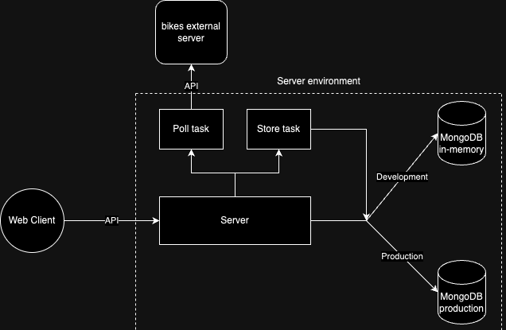

# fullinfo-test

# challenge

- Poll bike data for specified cities, calculate and store the average of free bikes
- Smartly detect polling interval
- Add Elegant UI

---

# UI


---

# architecture



---

# storage

Data is stored in in-memory MongoDB for development with 0 configuration
Also can be stored in regular MondoDB for production, using ```mongoUrl```
Storage happens every ```storeIntervalSeconds```

---

# average calculation

We have a list of total average free bikes in the same city measured within equal periods.
Hourly free bike average calculated as average of these values.
For the most correct estimation we need the periods to be as minimum as possible, gathered on every api update

---

# polling

The list of available networks checked using ```networksUrl```, assumed the change is rare, cached for every ```networkCacheMinutes```
The list of stations per every city checked using ```networkUrl```
if not defined, smartly detect polling interval before server start
Adjust polling interval on every store event

---

# detection algorithm

Polling interval calculated as minimal difference among corresponding stations timestamps between polls

if ```pollIntervalSeconds``` not defined, smartly detect polling interval before server start:

- poll with initial interval of ```pollIntervalSecondsInit```
- within maximum period of ```pollIntervalSecondsMax```
- stop if poll interval reaches ```pollIntervalSecondsMin```

Adjust polling interval on every store event

---